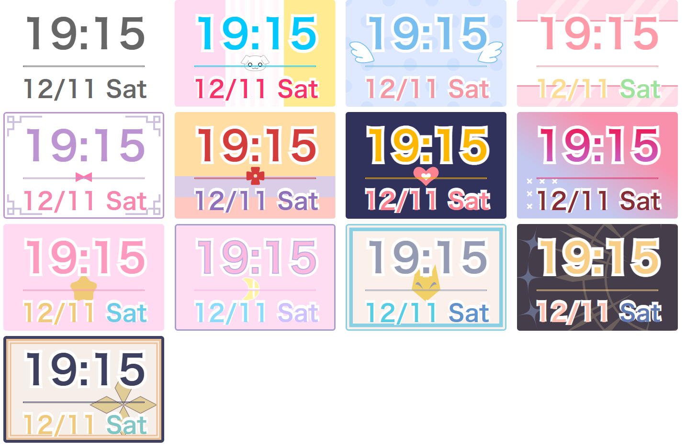
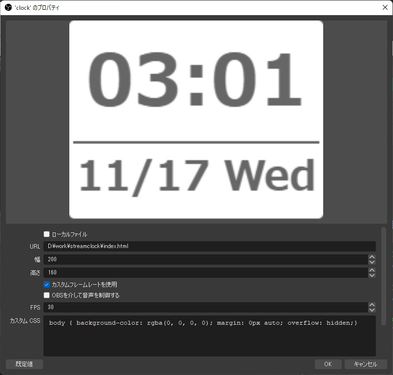

# Stream Clock

## DL
[DOWNLOAD](https://github.com/mafumafuultu/streamclock/archive/refs/heads/main.zip)

## Demo

### Theme
`https://mafumafuultu.github.io/streamclock/?theme=~~~~`

[default](https://mafumafuultu.github.io/streamclock/?style=default)  
[warabe](https://mafumafuultu.github.io/streamclock/?theme=warabe&style=default)  
[lilith](https://mafumafuultu.github.io/streamclock/?theme=lilith&style=default)  
[kirara](https://mafumafuultu.github.io/streamclock/?theme=kirara&style=default)  
[momo](https://mafumafuultu.github.io/streamclock/?theme=momo&style=default)  
[nia](https://mafumafuultu.github.io/streamclock/?theme=nia&style=default)  
[iroha](https://mafumafuultu.github.io/streamclock/?theme=iroha&style=default)  
[regrush](https://mafumafuultu.github.io/streamclock/?theme=regrush&style=default)  
[shin](https://mafumafuultu.github.io/streamclock/?theme=shin&style=default)  

### Style
`https://mafumafuultu.github.io/streamclock/?theme=default&style=~~~~`

[default](https://mafumafuultu.github.io/streamclock/?theme=default)  
[live](https://mafumafuultu.github.io/streamclock/?theme=default&style=live)  
[long](https://mafumafuultu.github.io/streamclock/?theme=default&style=long)  

### Debug
[Theme & style select](https://mafumafuultu.github.io/streamclock/debug.html)

## obs
default size: 233x150

If you want to change the font, specify the `font-family` in the `body` of the custom CSS.
In that case, you need to adjust the size according to the font.