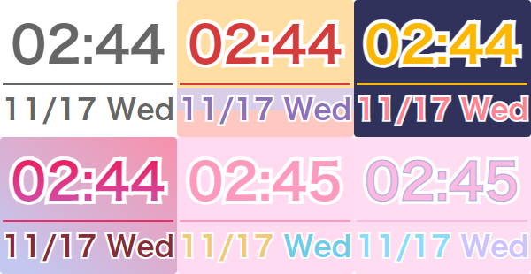

# Stream Clock


## Demo
[default](https://mafumafuultu.github.io/streamclock/)  
[warabe](https://mafumafuultu.github.io/streamclock/?theme=warabe)  
[lilith](https://mafumafuultu.github.io/streamclock/?theme=lilith)  
[kirara](https://mafumafuultu.github.io/streamclock/?theme=kirara)  
[momo](https://mafumafuultu.github.io/streamclock/?theme=momo)  
[nia](https://mafumafuultu.github.io/streamclock/?theme=nia)  

`https://mafumafuultu.github.io/streamclock/?theme=~~~~`

## DL
[DOWNLOAD](https://github.com/mafumafuultu/streamclock/archive/refs/heads/main.zip)




```html
<div id="clock" class=""></div>
```
```html
<div id="clock" class="warabe"></div>
```
```html
<div id="clock" class="lilith"></div>
```
```html
<div id="clock" class="kirara"></div>
```
```html
<div id="clock" class="momo"></div>
```
```html
<div id="clock" class="nia"></div>
```

## obs
default size: 200x150


If you want to change the font, specify the `font-family` in the `body` of the custom CSS.
In that case, you need to adjust the size according to the font.